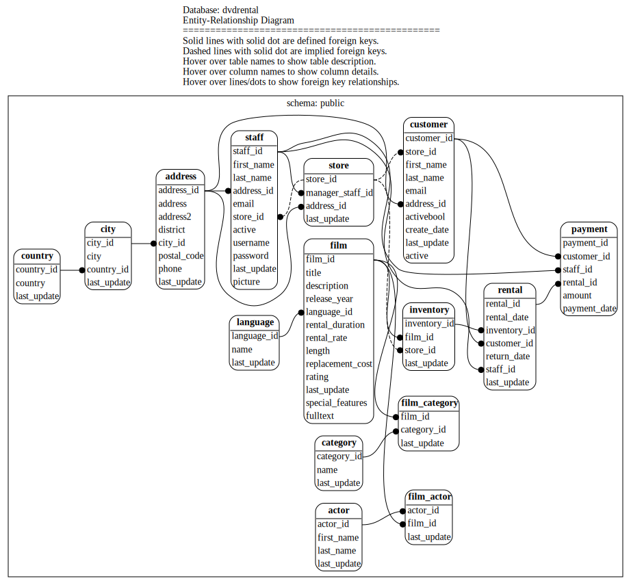

# PostgreSQL E-R Diagram Geneator

Tool to generate referential integrity matches, either defined or implied.

## Features

### Graphic Format

The output is generated as an SVG, which is easily resizeable.

### Compact Presentation

The diagram itself focuses on the relationships between tables, and hiding information about data types, etc behind tooltips.

### Tooltips

The file generated is an SVG file that has fairly basic ER-Diagram information presented. However, each table, column and relationship is given a tooltip which can be viewed by hovering over the 

Tooltip information for columns:
* name
* data type
* whether or not the column is a part of a primary key
* if the column allows `NULL`s or is `NOT NULL`
* any description (aka `COMMENT ON COLUMN...`) data provided in the catalog.

Tooltip information for tables:
* name
* any description (aka `COMMENT ON TABLE...`) data provided in the catalog.

Tooltip information for referential integrity relationships:
* Whether the relationship is defined in the catalog, or inferred through name matching.
* name of the constraint
* any description (aka `COMMENT ON CONSTRAINT...`) data provided in the catalog.

### Minimal Dependencies

This tool was initially used for investigations into client databases, clients who can have significant restrictions on installing software and giving out database credentials. Therefore, it was designed to be as lightweight as possible and require as few dependencies as possible:

* `psql`: The command line tool for [postgresql](https://postgresql.org/)
* `dot`: The command line tool for [GraphViz](https://www.graphviz.org/)

### Shows Implied Foreign Keys

Not all databases define and enforce foreign key relationships. Some postgres variants (Redshift, etc) do not support foreign keys at all. For those cases, the tool will seek out column names that are similar to existing table names and a suffix from the list:

| Table Suffixes |
| --- |
| `id` | `_id` | `_key` | `_ref` |

In addition, if the table ends in an `s`, it will also match values that have removed the final `s`. For instance, the table name `books` will match any of the following column names:

| Column names that would match `books` |
| --- |
| `booksid` | `books_id` | `books_key` | `books_ref` |
| `bookid` | `book_id` | `book_key` | `book_ref` |


### Can Work With Postgres-like Databases

This tool makes extensive use of the PostgreSQL `pg_catalog` tables and the connection library `libpq` which is used by `psql`. As such, any fork of `PostgreSQL` which hasn't modified the internals too greatly should be able to use this tool.


## Usage

```
[env=value ...] ./pg_erd.sh [ -h | --help ]
```

### Command Line Options

| Option | Description |
| --- | --- |
| `-h` or `--help` | Display the help text and exit. |

### Environment Variables

Rather than have a rich set of command line options (and requiring `getopt`/`getopts`), this program instead leverages environment variables, often passed in as prefixes on the command line.

Because this program invokes `psql` it respects all [libpq environment variables](https://www.postgresql.org/docs/current/libpq-envars.html) such as `PGSERVICE`, `PGHOST`, etc.

In addition, it also resepects the following environment variables:

| Environment Variable | Description |
| --- | --- |
| `PGERD_FILE_PREFIX` | If provided, all files generated should being with this string. The default is an empty string. |
| `PGERD_SCHEMA_PATTERN` | If provided, is a SQL ILIKE pattern of names of schemas to graph. The default is `%`. |
| `PGERD_GRAPH_PER_SCHEMA` | If set to `true`, then the program will generate one graph per schema in addition to the all-schema graph. The default is `false`. |
| `PGERD_KEEP_DOTFILES` | If set to `true`, then the program will not delete the .dot files that were generated for graphviz. The default is `false`. |
| `PGERD_SHOW_IMPLIED_REFERENCES` | If set to `true`, then the graph will show dotted lines between columns that are likely to be foreign keys to other tables based on name matching between that column name and the table name. This is often helpful in situations where referential integrity is not enforced, either as a design decision or because the postgresql variant does not suppport referential integrity (ex. Redshift). The default is `true`. |
| `PGERD_SHOW_PARTITIONS` | If set to `true`, the graph will include all partitions of a partitioned table. While it is true that members of a partitioned table can have additional columns and referential integrity constraints independent of the parent table, this is rarely the case and therefore the partitions just add clutter to the graph. The default is `false`. |


### Examples

The examples below were generated using the [dvdrental](https://www.postgresqltutorial.com/postgresql-getting-started/postgresql-sample-database/) sample database installed locally, which makes it possible to connect to the databse simply through the `PGDATABASE` environment variable.

In the simplest case, provide connection info as a prefix:

```
PGDATABASE=dvdrental ./pg_erd.sh
```

which gives the output:

```
all schemas...erd.svg
```

It also generates a file that looks like this:



The tooltips can be seen either by opening the SVG file directly in a browser, or via the `Raw` view option in github.


## Files

| File Name | Description |
| --- | --- |
| `pg_erd.sh` | The shell script that is invoked by the user. |
| `pg_erd.sql` | A SQL script run via `psql` inside `pg_erd.sh`. Users will not directly interact with this file. |

