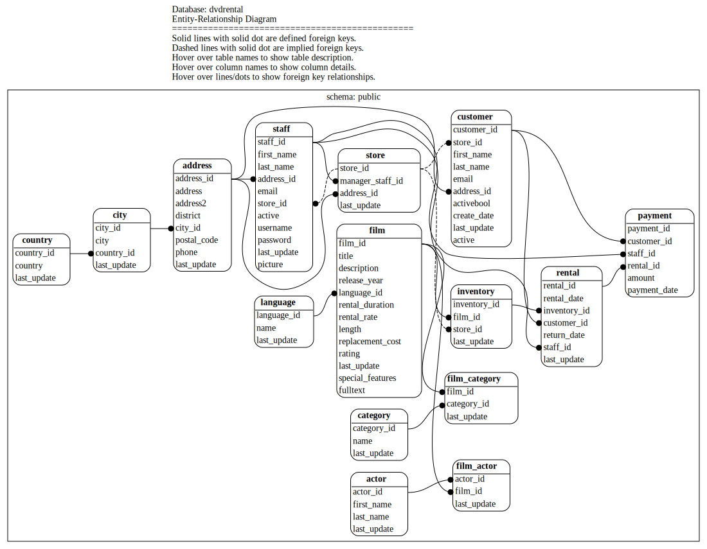

# PostgreSQL E-R Diagram Geneator

Script to generate referential integrity matches, either defined or implied.

The design goal is to generate an SVG output with tooltip details using as few dependencies as possible.

## Usage

```
[env=value ...] ./pg_erd.sh [ -h | --help ]
```

### Command Line Options

| Option | Description |
| --- | --- |
| `-h` or `--help` | Display the help text and exit. |

### Environment Variables

Rather than have a rich set of command line options (and requiring `getopt`/`getopts`), this program instead leverages environment variables, often passed in as prefixes on the command line.

Because this program invokes `psql` it respects all [libpq environment variables](https://www.postgresql.org/docs/current/libpq-envars.html) such as `PGSERVICE`, `PGHOST`, etc.

In addition, it also resepects the following environment variables:

| Environment Variable | Description |
| --- | --- |
| `PGERD_FILE_PREFIX` | If provided, all files generated should being with this string. The default is an empty string. |
| `PGERD_SCHEMA_PATTERN` | If provided, is a SQL ILIKE pattern of names of schemas to graph. The default is `%`. |
| `PGERD_GRAPH_PER_SCHEMA` | If set to `true`, then the program will generate one graph per schema in addition to the all-schema graph. The default is `false`. |
| `PGERD_KEEP_DOTFILES` | If set to `true`, then the program will not delete the .dot files that were generated for graphviz. The default is `false`. |
| `PGERD_SHOW_IMPLIED_REFERENCES` | If set to `true`, then the graph will show dotted lines between columns that are likely to be foreign keys to other tables based on name matching between that column name and the table name. This is often helpful in situations where referential integrity is not enforced, either as a design decision or because the postgresql variant does not suppport referential integrity (ex. Redshift). The default is `true`. |
| `PGERD_SHOW_PARTITIONS` | If set to `true`, the graph will include all partitions of a partitioned table. While it is true that members of a partitioned table can have additional columns and referential integrity constraints independent of the parent table, this is rarely the case and therefore the partitions just add clutter to the graph. The default is `false`. |


### Examples

The examples below were generated using the [dvdrental](https://www.postgresqltutorial.com/postgresql-getting-started/postgresql-sample-database/) sample database installed locally, which makes it possible to connect to the databse simply through the `PGDATABASE` environment variable.

In the simplest case, provide connection info as a prefix:

```
PGDATABASE=dvdrental ./pg_erd.sh
```

which gives the output:

```
all schemas...erd.svg
```

It also generates a file that looks like this:



## Installation Dependencies

This tool is designed to be as lightweight as possible and require as few dependencies as possible.

* `psql`: The command line tool for [postgresql](https://postgresql.org/)
* `dot`: The command line tool for [GraphViz](https://www.graphviz.org/)

## Other Databases

This tool makes extensive use of the PostgreSQL `pg_catalog` tables and the connection library `libpq` which is used by `psql`. As such, any fork of `PostgreSQL` which hasn't modified the internals too greatly should be able to use this tool.

## Files

| File Name | Description |
| --- | --- |
| `pg_erd.sh` | The shell script that is invoked by the user. |
| `pg_erd.sql` | A SQL script run via `psql` inside `pg_erd.sh`. Users will not directly interact with this file. |

